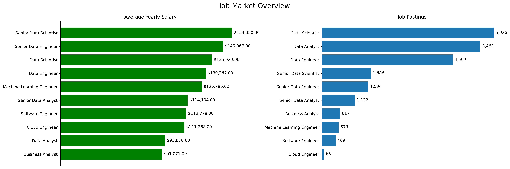
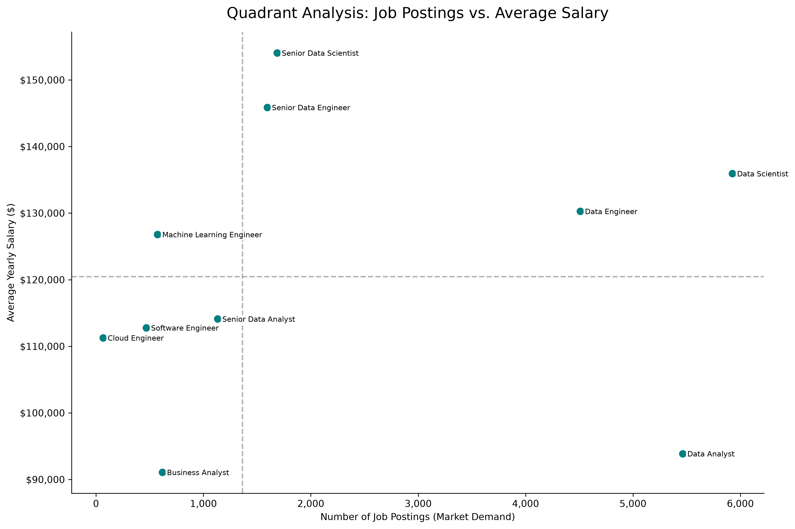
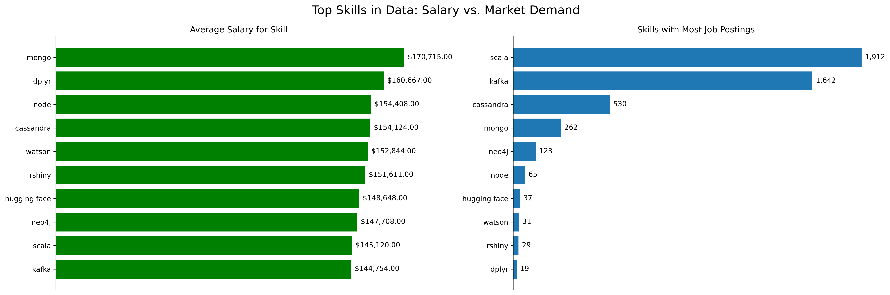
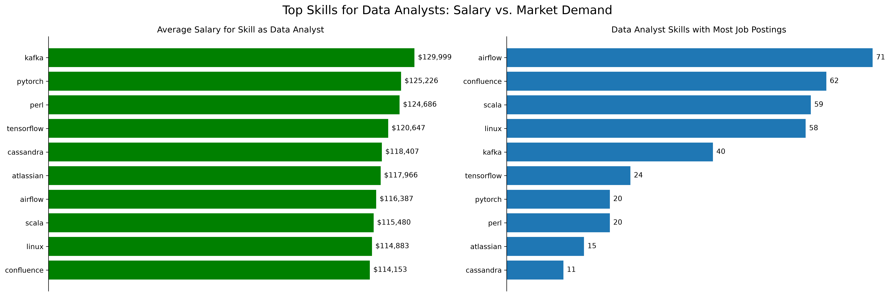
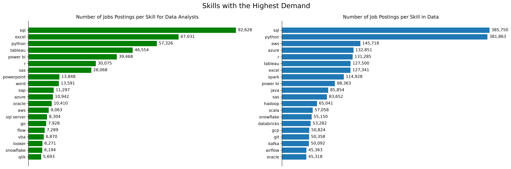
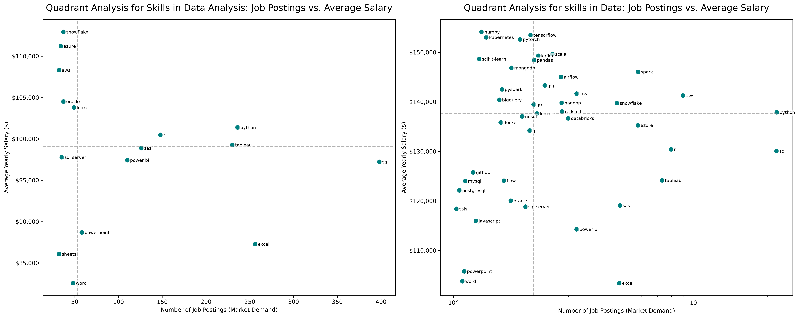

# Python SQL Data Analysis: Market Trends

## Project Overview
This project performs an in-depth analysis of the current data job market. By analyzing the relationship between market demand (number of job postings) and compensation (average yearly salary), this project identifies the "sweet spot" for career growth and skill acquisition.

The goal of this analysis was to move beyond anecdotal evidence and use data to determine which skills offer the highest return on investment for data professionals.

Link for data: https://drive.google.com/drive/folders/1moeWYoUtUklJO6NJdWo9OV8zWjRn0rjN

## Key Insights
* **The "Sweet Spot" Analysis:** Using quadrant analysis, we identified skills that offer both high market demand and competitive salaries.
* **Role-Specific Trends:** We compared the specific needs of "Data Analysts" versus the broader "Data" field to highlight how skill requirements shift across roles.
* **Outlier Detection:** The analysis accounts for high-volume, lower-salary "baseline" skills like Excel/SQL, while highlighting high-value, specialized technologies like Cloud platforms and Big Data tools.

## Visualizations









## Repository Structure
The repository is organized to ensure reproducibility and clear project navigation:

```text
PYTHONSQL-DATA-ANALYSIS/
├── assets/          # Exported visualizations and presentation images
├── csv_files/       # Raw and processed datasets
├── notebooks/       # Jupyter Notebooks containing the analysis code
├── sql_queries/     # SQL queries used to aggregate and prepare the data
├── sql_load/        # Scripts for loading data into your database
├── .gitignore       # Files excluded from version control (e.g., venv/)
├── README.md        # Project documentation
└── requirements.txt # Project dependencies
```
## How to Run This Project

Follow these steps to replicate the environment and explore the data:

1. **Clone the repository:**
   ```bash
   git clone https://github.com/your-username/PYTHONSQL-DATA-ANALYSIS.git
   cd PYTHONSQL-DATA-ANALYSIS
   ```
2. **Install dependencies:**
  Ensure you are in the project root directory and run:

  ```bash
  pip install -r requirements.txt
  ```
3. **Launch the analysis:**
  Navigate to the notebooks directory and start your Jupyter server:

  ```bash
  jupyter notebook notebooks/
  ```


## Tech Stack
Language: Python

Data Analysis: Pandas, SQL

Visualization: Matplotlib

Environment: Jupyter Notebooks

Acknowledgments
This project was built to analyze current job market trends and provide actionable insights for data career planning.
